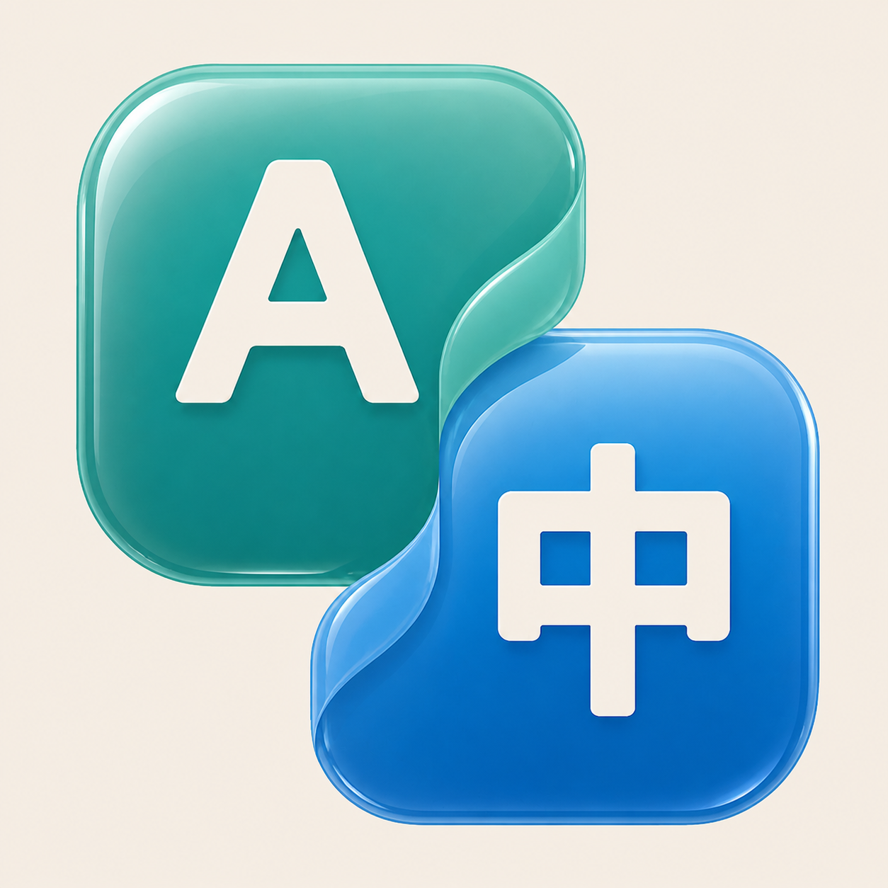

# 屏幕译 Screen Translator



按一下快捷键，把当前屏幕上的外语原位覆盖成中文；再按一下，立即恢复原画面。软件常驻菜单栏或系统托盘，译文覆盖层允许鼠标点击穿透。

[从 Releases 下载最新版](https://github.com/y2675632584-hub/screen-translator/releases/latest)

## 支持平台

| 平台 | 下载包 | 翻译方式 | 系统要求 |
| --- | --- | --- | --- |
| macOS | `ScreenTranslator-macOS-arm64.zip` | Apple Vision + Apple Translation，本机处理，无需密钥 | macOS 26+，Apple Silicon |
| Windows | `ScreenTranslator-Windows-x64.zip` | Windows OCR + OpenAI，只上传识别后的文字 | Windows 10 2004+ / Windows 11，x64 |

两个版本均支持自定义任意普通按键或组合键、实时/单次翻译、原文语言自动识别或手动选择、目标语言选择、字号调节和开机启动。

## macOS 使用方法

1. 下载并解压，把 `屏幕译.app` 拖入“应用程序”。
2. 第一次打开时按系统提示允许屏幕录制，并准备需要的语言包。
3. 把鼠标移到要翻译的显示器，按 **F8**；部分键盘需要 **Fn + F8**。
4. 再按同一个键关闭翻译。关闭设置窗口后，软件仍在菜单栏运行。

当前公开包使用临时签名，尚未经过 Apple 公证。若系统阻止首次打开，请在 Finder 中按住 Control 点击应用，选择“打开”；或在“系统设置 → 隐私与安全性”中选择“仍要打开”。更换版本后，macOS 可能要求重新确认屏幕录制权限。

## Windows 使用方法

1. 下载并解压完整文件夹，运行 `ScreenTranslator.exe`。
2. 在设置中填入自己的 OpenAI API Key，选择原文和目标语言并保存。
3. 按 **F8** 开始；再按一次关闭。软件退出设置窗口后仍在系统托盘运行。
4. 如果识别列表中缺少某种语言，请在“Windows 设置 → 时间和语言 → 语言和区域”安装对应语言及 OCR 组件。

Windows 版不上传截图。截图和 OCR 均在电脑内存中完成，只将识别出的文字发送给 OpenAI 翻译；API Key 使用当前 Windows 账户加密保存。使用 OpenAI API 会按你的账户用量计费。

## 隐私

- 不保存截图、OCR 历史或翻译历史。
- 关闭翻译后立即停止采集并清空本轮缓存。
- macOS 版不把屏幕内容发送给本项目维护者或第三方服务器。
- Windows 版只按用户主动开启的时间，将 OCR 文字发送给 OpenAI；细节见 [PRIVACY.md](PRIVACY.md)。

## 从源码构建

### macOS

需要 Xcode 26 和 Swift 6：

```sh
bash scripts/build-app.sh
```

输出位于 `dist/屏幕译.app`。

### Windows

需要 .NET 8 SDK，在 Windows PowerShell 中运行：

```powershell
dotnet publish windows/ScreenTranslator.Win/ScreenTranslator.Win.csproj -c Release -r win-x64
```

## 项目结构

- `Sources/ScreenTranslator`：macOS 应用。
- `windows/ScreenTranslator.Win`：Windows 应用。
- `Resources`：应用图标和 macOS 资源。
- `.github/workflows/build-and-release.yml`：自动构建两个平台并生成 Release。

## 已知限制

- 受保护的视频画面、过小文字、艺术字体和低对比度内容可能无法识别。
- 第一版不承诺视频字幕逐帧实时翻译。
- macOS 公开包在获得 Apple Developer 签名证书前无法完成公证。
- Windows 公开包在获得代码签名证书前可能显示 SmartScreen 提示。

本项目使用 [MIT License](LICENSE)。
